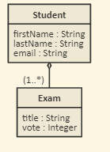

# Data Base
Un database è un software per l'archiviazione di dati.
I dati vengono memorizzati in tabelle attraverso creazioni, aggiornamenti e cancellazioni e vengono recuperati attraverso operazioni di lettura.
L'insieme di queste operazioni viene definito con l'acronimo CRUD (Create, Read, Update, Delete).
Queste operazioni vengono effettuate eseguendo istruzioni SQL (Structured Query Language)

## Data Definition Language
Una tabella viene creata attraverso l'esecuzione di comandi SQL definiti DDL.

### Create 
Per creare una tabella è necessario definirne il nome e i campi con tipo e vincoli.
 
~~~sql
CREATE TABLE table_name (
    column1 datatype costraint,
    column2 datatype costraint,
   ....
);
~~~

Esempio

~~~sql
CREATE TABLE student (
    id integer not null, 
    email varchar(255), 
    first_name varchar(255), 
    last_name varchar(255), 
    primary key (id)
)
~~~

Nell'istruzione _primary key_ viene indicato il campo univoco della tabella.

### Drop
Per cancellare una tabella è necessario indicarne il nome

~~~sql
DROP TABLE table_name; 
~~~

Esempio

~~~sql
DROP TABLE student; 
~~~

### Alter
Per aggiungere, cancellare o modificare i campi di una tabella esistente è necessario indicare il nome della tabella e del campo con l'operazione che si intende eseguire

~~~sql
ALTER TABLE table_name
ADD column_name datatype
~~~

Esempio

~~~
ALTER TABLE student
ADD birth_date date
~~~

 
## Data Manipulation Language
I dati vengono manipolati attraverso l'esecuzione di comandi SQL definiti DML.

### Create
La creazione dei dati avviene con un'operazione di INSERT

~~~sql
INSERT INTO table_name (column1, column2, ...)
VALUES (value1, value2, ...);
~~~

Esempio

~~~sql
INSERT INTO student (id, email, first_name, last_name)
VALUES (1, 'm.rossi@gmail.com', 'mario', 'rossi');
~~~

### Read
La lettura dei dati avviene con un'operazione di SELECT

~~~sql
SELECT column1, column2, ...
FROM table_name
WHERE condition;
~~~

Esempio

~~~
SELECT * FROM student where last_name='rossi'
~~~

### Update
L'aggiornamento dei dati avviene con un'operazione di UPDATE

~~~sql
UPDATE table_name
SET column1 = value1, column2 = value2, ...
WHERE condition;
~~~

Esempio

~~~
UPDATE student set email='m.rossi@libero.it' where id=1
~~~

### Delete
La cancellazione di dati avviene con un'operazione di DELETE

~~~
DELETE FROM table_name WHERE condition;
~~~

Esempio

~~~
DELETE FORM student WHERE id=1
~~~
    
## Relazioni tra tabelle
Le tabelle possono essere relazionate tra loro attraverso un campo denominato _foreign key_: esso è un campo di una tabella che si riferisce alla _primary key_ di un'altra tabella

~~~sql
CREATE TABLE exam (
    id int NOT NULL,
    title varchar(255),
    vote int NOT NULL,
    student_id int NOT NULL,
    PRIMARY KEY (id),
    FOREIGN KEY (student_id) REFERENCES student(id)
);
~~~

La lettura di dati da più tabelle avviene con un'operazione definita join

~~~sql
select first_name, last_name, title, vote from exam, student where exam.student_id = student.id
~~~  

# Tutorials online

[SQL Tutorial 1](https://www.w3schools.com/sql/),
[SQL Tutorial 2](https://www.javatpoint.com/dbms-tutorial),
[H2 Tutorial](https://h2database.com/html/main.html)
